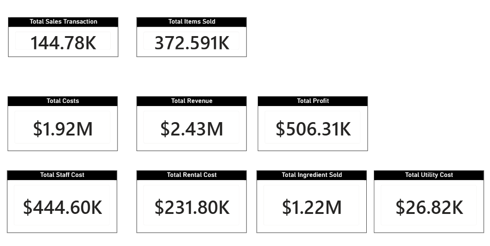
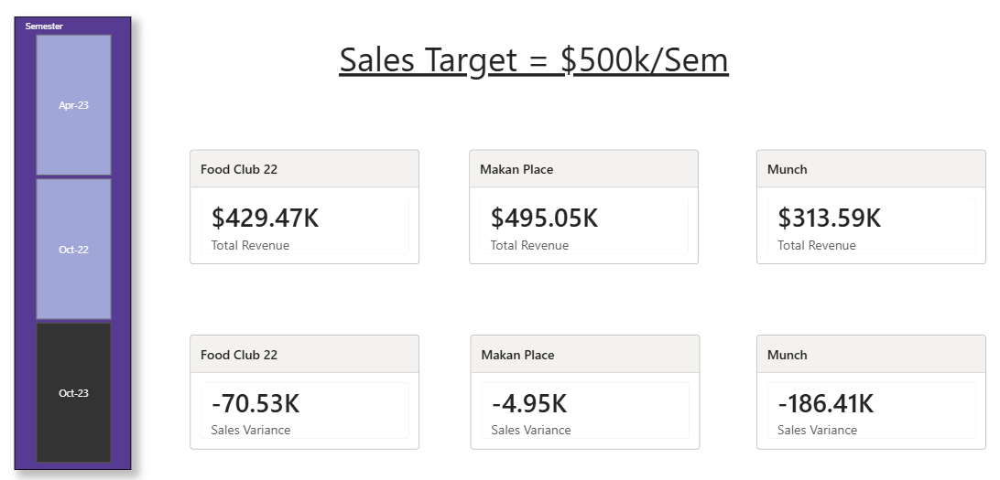
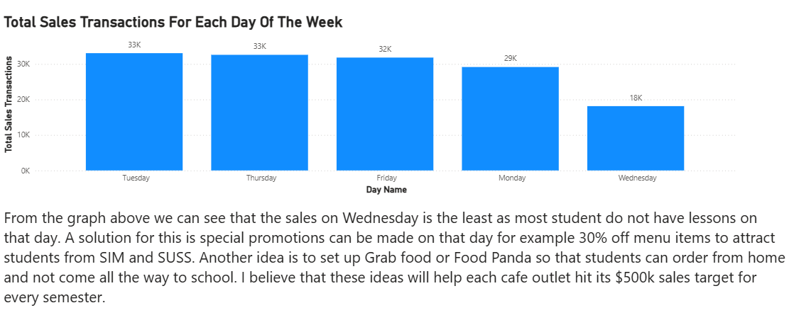
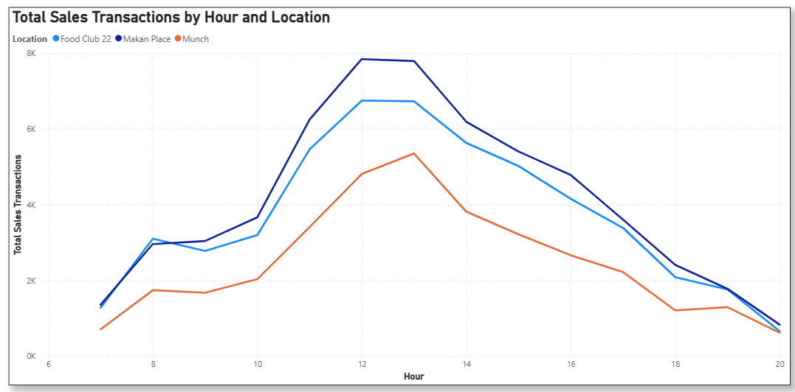
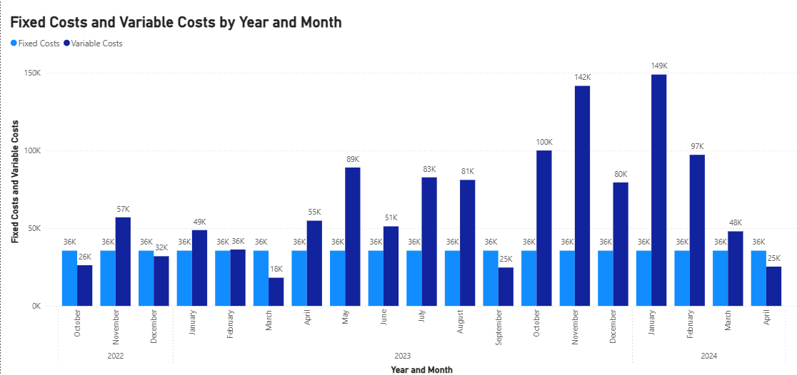
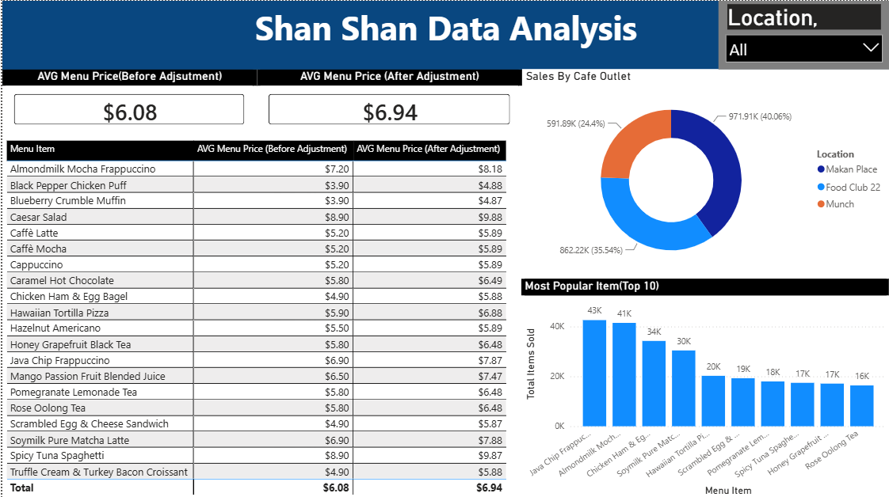

# Campus Café Sales & Profitability Analysis — Power BI

An 11-page Power BI report analysing **144,780 transactions** and **372,591 items
sold** across three campus food outlets over three semesters. Point-of-sale data
is joined to menu costs, monthly operating costs and an academic calendar to
answer one business question: how do these outlets close the gap to a **$500,000
per semester** sales target?

The analysis finds that the shortfall isn't spread evenly — it concentrates in a
single weekday, driven by the teaching timetable rather than by anything the
outlets are doing wrong.

| | |
|---|---|
| **Total revenue** | $2.43M |
| **Total costs** | $1.92M |
| **Total profit** | $506.31K *(20.8% margin)* |
| **Transactions** | 144,780 |
| **Items sold** | 372,591 *(2.57 per order)* |

---

## Problem

> **Objective:** To improve total revenue and profitability of canteen vendors in
> order to support long-term financial sustainability.
>
> **Driving question:** How to improve Total Revenue so that the Profit of each
> Canteen increases?

Three outlets — **Makan Place**, **Food Club 22** and **Munch** — operate on the
same campus, serve overlapping menus, and are each measured against a $500k
per-semester target. They share a customer base whose presence is dictated
entirely by a timetable, which makes demand highly predictable *if* you model it
against the academic calendar rather than the ordinary one.

## Data model

Five source tables, related into a star schema:

| Table | Rows | Contents |
|---|---:|---|
| **Sales — Oct 2022** | 60,735 | Order ID, Date, Menu Item, Quantity, Location, Mode |
| **Sales — Apr 2023** | 104,486 | as above |
| **Sales — Oct 2023** | 150,444 | as above |
| **Menu Prices** (Oct 22 & Oct 23) | 21 items each | Category, Menu Item, **Cost**, **Price** |
| **Operating Costs** | 58 | Op Month, Location, Rental Cost, Staff Salaries, Utility Expenses |
| **Academic Calendar** | 547 | Semester, Week, Date, Weekday Attribute |

Two joins do most of the analytical work.

**Menu Prices → Sales** turns quantities into money. Because the workbook holds
*two* price lists — October 2022 and October 2023 — the same basket can be costed
at both, which is what makes the **price-adjustment comparison** possible: how
much of the revenue change came from selling more, and how much simply from
charging more?

**Academic Calendar → Sales** is the join that makes the findings interpretable.
A raw date tells you a Wednesday was quiet. A date joined to a semester, teaching
week and school-day flag tells you *why*.

## Measures

| Measure | Purpose |
|---|---|
| `Total Revenue` | Quantity × menu price |
| `Total Ingredient Cost` | Quantity × item cost — the variable cost of goods |
| `Total Costs` | Ingredient cost plus rental, staff and utilities |
| `Total Profit` | Revenue less total costs |
| `Total Items Sold` | Unit volume |
| `Total Sales Transactions` | Distinct orders — separates basket size from footfall |
| `Fixed Costs` / `Variable Costs` | Cost-structure split |
| `AVG Menu Price (Before / After Adjustment)` | Effect of the price revision |
| `Sales Variance` | Actual revenue against the $500k semester target |
| `Date Duration (Days)` | Normalises comparisons across unequal periods |

Separating **transactions** from **items sold** matters more than it looks: it
distinguishes *fewer customers* from *customers buying less*, and those two
problems have completely different fixes. At 2.57 items per order, this is a
footfall business, not a basket-size one.

## Findings

### Every outlet misses the target — but by wildly different margins

October 2023 semester, against the $500k target:

| Outlet | Revenue | Variance | % of target |
|---|---:|---:|---:|
| Makan Place | $495.05K | −$4.95K | 99.0% |
| Food Club 22 | $429.47K | −$70.53K | 85.9% |
| Munch | $313.59K | −$186.41K | 62.7% |

Makan Place is within 1% of target. **Munch misses by 37%** — and $186K of the
combined $262K shortfall sits with that one outlet. A blanket campus-wide
intervention would therefore be aimed mostly at outlets that don't need it.

### Wednesday is a structural hole, not a bad day

| Tuesday | Thursday | Friday | Monday | **Wednesday** |
|---:|---:|---:|---:|---:|
| 33K | 33K | 32K | 29K | **18K** |

Wednesday runs at **55% of a typical Tuesday** — a 45% drop, far outside the
variation between the other four days, which sit within 12% of each other.

Joined against the academic calendar, the cause is structural rather than
commercial: most students have no timetabled lessons on Wednesday, so they aren't
on campus. No menu or service improvement fixes a day when the customers are
somewhere else. Notably, the gap between Wednesday and the rest (~15K
transactions per week) is the same order of magnitude as the revenue shortfall.

### Demand is a spike, not a plateau

Trading runs 07:00–20:00, but transactions concentrate almost entirely into
**12:00–13:00**, where Makan Place peaks near 7.9K and Food Club 22 near 6.7K —
roughly triple the mid-morning level. Munch peaks an hour later at 13:00 and
stays the lowest of the three all day, consistent with it also being furthest
from target.

After 14:00 all three decline steadily for six hours. The outlets are staffed and
rented for a 13-hour day to serve what is effectively a 2-hour rush.

### The cost base doesn't flex — and five months it swallowed the business

This is the clearest chart in the report. **Fixed costs are a dead-flat $36K every
single month** across all 19 months. Variable cost — ingredients, the only
component that tracks demand — swings from **$18K to $149K**, a factor of eight.

| Cost | Amount | Type |
|---|---:|---|
| Ingredients | $1.22M | Variable — scales with demand |
| Staff salaries | $444.60K | Fixed |
| Rental | $231.80K | Fixed |
| Utilities | $26.82K | Fixed |

**$703K of the $1.92M cost base — 37% — is fixed**, incurred whether anyone turns
up or not.

In **five of nineteen months** — October and December 2022, March and September
2023, and April 2024 — the outlets spent *more on rent, staff and utilities than
on the food they actually sold.* March 2023 is the extreme: $36K fixed against
$18K variable, paying double in overheads what the kitchen turned over. Those
months line up with vacation periods, when the campus empties but the lease
doesn't pause.

The same logic scales down to a single day. A quiet Wednesday carries full rent
and full staffing while producing 55% of the transactions. That's what makes
filling quiet periods more valuable than trimming costs: with a ~50% gross margin
on goods, incremental off-peak covers contribute directly to fixed costs that are
already being paid.

### Growth came from price as much as volume

The October 2023 price revision lifted the average menu price from **$6.08 to
$6.94 — a 14.1% increase**. Any revenue growth across that boundary therefore has
to be split between selling more and charging more, which is exactly what having
both price lists in the model allows.

Revenue share across all three semesters:

| Outlet | Revenue | Share |
|---|---:|---:|
| Makan Place | $971.91K | 40.1% |
| Food Club 22 | $862.22K | 35.5% |
| Munch | $591.89K | 24.4% |

**Drinks dominate volume.** Three of the top four sellers are beverages — Java
Chip Frappuccino (43K units), Almondmilk Mocha Frappuccino (41K) and Soymilk Pure
Matcha Latte (30K) — with Chicken Ham & Egg Bagel (34K) the only food item near
the top. That matters for the discount proposal: beverages carry the better
margins, so a drinks-led Wednesday promotion costs less per unit of footfall than
discounting the whole menu.

## Recommendations

> From the graph above we can see that the sales on Wednesday is the least as most
> student do not have lessons on that day. A solution for this is special
> promotions can be made on that day for example 30% off menu items to attract
> students from SIM and SUSS. Another idea is to set up Grab food or Food Panda so
> that students can order from home and not come all the way to school. I believe
> that these ideas will help each cafe outlet hit its $500k sales target for every
> semester.

Both interventions target the Wednesday trough specifically rather than lifting
every day uniformly, and both work with the cost structure: because fixed costs
are incurred regardless, additional Wednesday volume — even discounted — still
contributes toward covering them. The dataset already records a Delivery
transaction mode, so the delivery demand pattern can be measured rather than
assumed.

## What I'd do differently

- **Quantify the discount.** The report identifies the Wednesday trough but
  doesn't model what 30% off does to margin. Ingredient cost per item is in the
  data, so the break-even uplift — how many extra covers the discount must
  generate to pay for itself — is computable, and would turn a suggestion into a
  business case.
- **Separate price growth from volume growth.** Both price lists are in the model
  and the average price rose 14.1%, but the report reports revenue without
  decomposing it. Holding volume constant and re-pricing at the old list would
  isolate how much of the increase was real demand.
- **Address the vacation months.** The five months where fixed cost exceeded
  variable cost are a larger structural problem than Wednesday, and the report
  charts them without drawing the conclusion.
- **Target the intervention by outlet.** Munch carries 71% of the shortfall. The
  recommendations apply campus-wide when the evidence points at one outlet.
- **Three pages share the name "Task 2."** They should be named for what they show.
- **No forecasting.** Three semesters supports a trend projection against the
  target rather than only reporting historical variance.
- **Basket analysis untouched.** Order ID groups items into baskets, so which
  items sell together — and therefore what to bundle into a promotion — is
  available but unexplored.
- **Weekday Attribute underused.** The calendar distinguishes school days from
  non-school days, which would generalise the Wednesday finding into a model of
  demand versus campus presence.

## Technologies

**BI** — Microsoft Power BI Desktop (data model, DAX measures, interactive report)
**Modelling** — Star schema across sales, price, cost and calendar tables
**Source data** — Excel workbook, seven sheets, ~315,000 rows
**Visuals** — KPI cards, clustered column & bar charts, line charts, donut chart, tables, slicers

## A note on the data

The source dataset and the `.pbix` file are **not published in this repository.**
The data was provided for the assignment and its licensing does not permit
redistribution, and the `.pbix` embeds the full model inside it.

The schema, measures and findings are documented above so the analysis is fully
legible without them.

## License

MIT — see [LICENSE](LICENSE). Applies to the documentation in this repository;
the underlying dataset is not covered and is not included.
